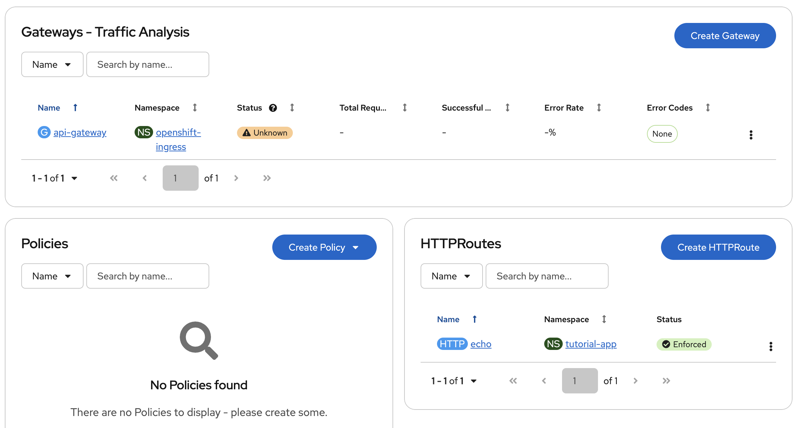
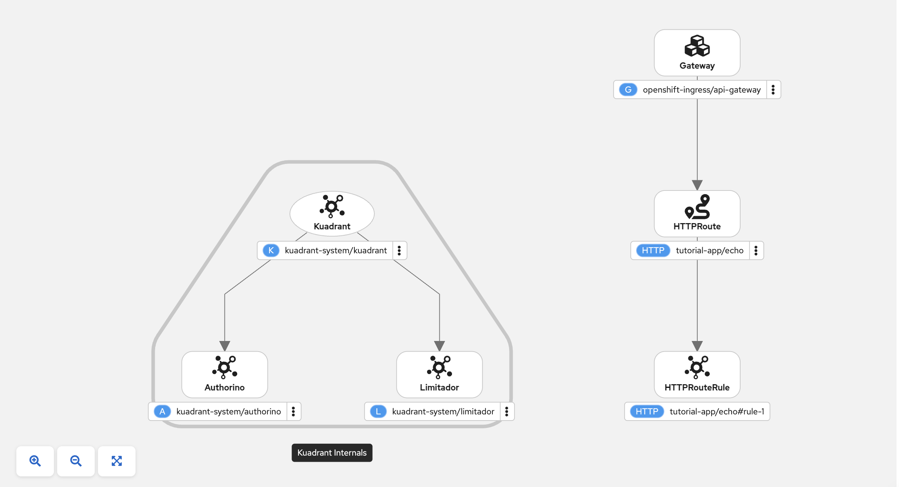

# 04 — Deploy Sample Application

This step deploys an HTTP echo service and routes traffic to it through the Gateway created in the previous step.

## What we're deploying

| Component | Details |
|-----------|---------|
| Image | `quay.io/nlembers/rest-echo-service:latest` |
| Description | REST echo service — responds with method, path, status, and headers as JSON |
| Port | 8080 (non-root, OpenShift-compatible) |
| Namespace | `tutorial-app` |
| Source | [`apps/rest-echo-service/`](../apps/rest-echo-service/) |

The echo service is useful for verifying that traffic flows correctly through the Gateway and that policies (auth, rate limiting) are applied in later steps.

## Prerequisites

- [03 — Create Gateway](../03-gateway/) completed
- `CLUSTER_DOMAIN` environment variable set:

```shell
source export-cluster-env.sh
```

## Step 1 — Create the application namespace

```bash
oc apply -f 04-app/namespace.yaml
```

## Step 2 — Deploy the echo service

```bash
oc apply -f 04-app/deployment.yaml
oc apply -f 04-app/service.yaml
```

Wait for the pod to be ready:

```bash
oc wait -n tutorial-app deployment/echo --for=condition=Available --timeout=120s
```

## Step 3 — Create the HTTPRoute

The HTTPRoute attaches to the Gateway in `openshift-ingress` and routes traffic for `echo.${CLUSTER_DOMAIN}` to the echo service.

```bash
envsubst < 04-app/httproute.yaml | oc apply -f -
```

Verify the HTTPRoute is accepted:

```bash
oc get httproute -n tutorial-app
# NAME   HOSTNAMES                                                 AGE
# echo   ["echo.apps.<cluster-domain>"]                            ...
```

Check the route status:

```bash
oc get httproute echo -n tutorial-app -o jsonpath='{.status.parents[0].conditions}' | python3 -m json.tool
# Should show Accepted: True, ResolvedRefs: True
```

## Step 4 — Verify end-to-end traffic

Send a request through the Gateway:

```bash
curl -s http://echo.$CLUSTER_DOMAIN/ | python3 -m json.tool
```

You should see a JSON response containing request details:

```json
{
  "method": "GET",
  "path": "/",
  "status": 200,
  "headers": {
    "host": "echo.apps.<cluster-domain>",
    "x-envoy-external-address": "...",
    "x-request-id": "...",
    "x-forwarded-proto": "http"
  },
  "tracing_headers": {
    "x-request-id": "..."
  }
}
```

Key indicators that traffic flows through the Envoy gateway:

- `x-envoy-external-address` — client IP as seen by Envoy
- `x-request-id` — unique request ID added by Envoy
- `tracing_headers` — distributed tracing headers extracted for visibility

Test with a POST request:

```bash
curl -s -X POST -H "Content-Type: application/json" \
    -d '{"message":"hello from tutorial"}' \
    http://echo.$CLUSTER_DOMAIN/api/test | python3 -m json.tool
```
## Step 5 — Inspect Gateway endpoints via Envoy EDS

The Envoy proxy exposes an admin interface that lets you inspect the Endpoint Discovery Service (EDS) — the set of upstream endpoints that the gateway knows about.

Port-forward to the Envoy admin interface and query the EDS config:

```bash
oc port-forward -n openshift-ingress deploy/api-gateway-openshift-default 15000:15000 2>/dev/null &
PF_PID=$!
sleep 2

curl -s 'http://localhost:15000/config_dump?include_eds' | python3 -c "
import json, sys
data = json.load(sys.stdin)
for config in data.get('configs', []):
    if 'EndpointsConfigDump' in config.get('@type', ''):
        for ep in config.get('dynamic_endpoint_configs', []):
            ec = ep.get('endpoint_config', {})
            cn = ec.get('cluster_name', '')
            for endpoint in ec.get('endpoints', []):
                for lb in endpoint.get('lb_endpoints', []):
                    addr = lb['endpoint']['address']['socket_address']
                    print(f\"{cn} {addr['address']}:{addr['port_value']}\")
" | grep echo

kill $PF_PID 2>/dev/null
```

You should see the echo service endpoint registered with Envoy:

```
outbound|80||echo.tutorial-app.svc.cluster.local 10.232.0.236:8080
```

This confirms the Gateway has discovered the echo service pod IP and port via EDS.

Now scale the echo deployment to 2 replicas:

```bash
oc scale deployment echo -n tutorial-app --replicas=2
oc wait -n tutorial-app deployment/echo --for=condition=Available --timeout=120s
```

Query EDS again to see both endpoints:

```bash
oc port-forward -n openshift-ingress deploy/api-gateway-openshift-default 15000:15000 2>/dev/null &
PF_PID=$!
sleep 2

curl -s 'http://localhost:15000/config_dump?include_eds' | python3 -c "
import json, sys
data = json.load(sys.stdin)
for config in data.get('configs', []):
    if 'EndpointsConfigDump' in config.get('@type', ''):
        for ep in config.get('dynamic_endpoint_configs', []):
            ec = ep.get('endpoint_config', {})
            cn = ec.get('cluster_name', '')
            for endpoint in ec.get('endpoints', []):
                for lb in endpoint.get('lb_endpoints', []):
                    addr = lb['endpoint']['address']['socket_address']
                    print(f\"{cn} {addr['address']}:{addr['port_value']}\")
" | grep echo

kill $PF_PID 2>/dev/null
```

You should now see two addresses — one for each pod:

```
outbound|80||echo.tutorial-app.svc.cluster.local 10.232.0.236:8080
outbound|80||echo.tutorial-app.svc.cluster.local 10.232.0.239:8080
```

Envoy automatically discovered the new endpoint via EDS and will load-balance traffic across both pods.

## Console UI Plugin

In the OpenShift UI, go to "Connectivity Link" -> "Overview". The Gateway state is unknown/unhealthy because it has no address (our workaround with OpenShift Route because we do not use a LoadBalancer or DNSPolicy). The HTTPRoute is healthy and enforced.



In the "Policy Topology" view you can see what we have deployed and configured.



## Manifests

| File | Resource | Purpose |
|------|----------|---------|
| `namespace.yaml` | `Namespace` | `tutorial-app` namespace for the application |
| `deployment.yaml` | `Deployment` | Echo server (1 replica, non-root) |
| `service.yaml` | `Service` | ClusterIP service on port 80 → container port 8080 |
| `httproute.yaml` | `HTTPRoute` | Routes `echo.${CLUSTER_DOMAIN}` through the Gateway to the echo service |

## Architecture

```
                  *.apps DNS
                      │
                      ▼
              ┌─────────────────┐
              │ Default Router  │  (HAProxy, HostNetwork)
              │ Port 80/443     │
              └────────┬────────┘
                       │ OpenShift Route
                       ▼
              ┌─────────────────┐
              │ Envoy Gateway   │  (api-gateway-openshift-default)
              │ openshift-ingress│
              └────────┬────────┘
                       │ HTTPRoute
                       ▼
              ┌─────────────────┐
              │ Echo Service    │  (tutorial-app namespace)
              │ Port 80 → 8080  │
              └─────────────────┘
```

## Next steps

Proceed to [05 — TLS Policy](../05-tls-policy/).
