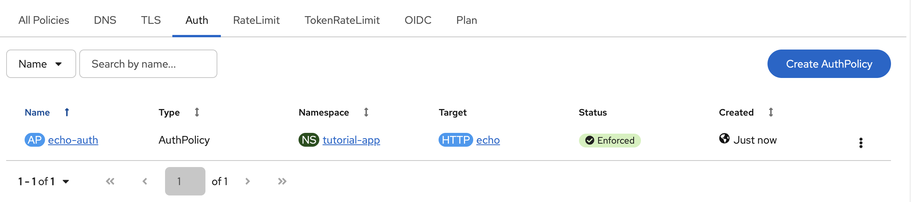

# 06 — Protect the API with AuthPolicy

**What you'll learn:** Install Keycloak as an OIDC identity provider, then use Kuadrant's AuthPolicy to enforce JWT-based authentication on your API. Unauthenticated requests are rejected with HTTP 401.

**Prerequisites:** Phases 00–05 completed (Gateway with TLS, echo app running).

## Step 0: Install Keycloak (OIDC Identity Provider)

AuthPolicy validates JWTs issued by an OIDC provider. Run the setup script to deploy the Red Hat build of Keycloak with PostgreSQL, create an OIDC realm, client, and test user:

```shell
./06-auth-policy/setup-keycloak.sh
```

> **Re-run note:** If `keycloak-pgsql-data` PVC already exists from a previous run, either delete the PVC and secret first, or reuse the same `KEYCLOAK_DB_PASSWORD`. A new random password with an existing PVC causes realm import failures.

The script applies the Keycloak manifests in `06-auth-policy/keycloak/` and waits for each component to become ready. When it finishes you'll see the OIDC discovery URL printed. If you prefer to install Keycloak step by step, follow the [manual installation guide](keycloak/README.md).

### OIDC Configuration Reference


| Parameter      | Value                                                                                                |
| -------------- | ---------------------------------------------------------------------------------------------------- |
| Issuer URL     | `https://keycloak.${CLUSTER_DOMAIN}/realms/connectivity-link-tutorial`                               |
| Token endpoint | `https://keycloak.${CLUSTER_DOMAIN}/realms/connectivity-link-tutorial/protocol/openid-connect/token` |
| JWKS URI       | `https://keycloak.${CLUSTER_DOMAIN}/realms/connectivity-link-tutorial/protocol/openid-connect/certs` |
| Client ID      | `tutorial-app`                                                                                       |
| Client secret  | `tutorial-app-secret`                                                                                |
| Test user      | `testuser` / `testuser`                                                                              |

## How AuthPolicy Works

AuthPolicy is a Kuadrant CRD that attaches authentication and authorization rules to Gateway API resources. When targeting an HTTPRoute, the Authorino component (deployed by Connectivity Link) intercepts every request and evaluates the configured rules before forwarding to the backend.

```
┌────────┐    request     ┌──────────────┐   authenticated   ┌─────────┐
│ Client │ ──────────────►│    Envoy     │ ─────────────────►│  echo   │
│        │                │   Gateway    │                   │ Service │
│        │◄──── 401 ──────│              │                   │         │
└────────┘  (no/bad JWT)  │  AuthPolicy  │                   └─────────┘
                          │  (Authorino) │
                          │      │       │
                          │      │ JWKS  │
                          │      ▼       │
                          │  ┌────────┐  │
                          │  │Keycloak│  │
                          │  │ (OIDC) │  │
                          │  └────────┘  │
                          └──────────────┘
```

The AuthPolicy in this phase uses **JWT authentication**:
- Authorino fetches the JWKS keys from Keycloak's OIDC discovery endpoint
- Each incoming request must carry a valid `Authorization: Bearer <token>` header
- The JWT signature, expiry, and issuer are verified against Keycloak's keys
- Invalid or missing tokens result in HTTP 401 Unauthorized

## Step 1: Review the AuthPolicy Manifest

The policy targets the `echo` HTTPRoute and configures JWT authentication against the Keycloak realm:

```yaml
# 06-auth-policy/auth-policy.yaml
apiVersion: kuadrant.io/v1
kind: AuthPolicy
metadata:
  name: echo-auth
  namespace: tutorial-app
spec:
  targetRef:
    group: gateway.networking.k8s.io
    kind: HTTPRoute
    name: echo
  rules:
    authentication:
      keycloak-jwt:
        jwt:
          issuerUrl: https://keycloak.${CLUSTER_DOMAIN}/realms/connectivity-link-tutorial
```

Key points:
- **targetRef** points to the `echo` HTTPRoute in the `tutorial-app` namespace
- **authentication.keycloak-jwt** is a named authentication rule using JWT verification
- **issuerUrl** points to the Keycloak realm — Authorino automatically discovers the JWKS endpoint via OIDC discovery

## Step 2: Apply the AuthPolicy

```shell
source export-cluster-env.sh
envsubst < 06-auth-policy/auth-policy.yaml | oc apply -f -
```

Wait for the policy to be accepted and enforced:

```shell
oc get authpolicy echo-auth -n tutorial-app
```

Both conditions should be `True`:

```shell
oc get authpolicy echo-auth -n tutorial-app -o jsonpath='{.status.conditions}' | python3 -m json.tool
# Accepted: True, Enforced: True
```

> **Note:** Envoy may take up to 60 seconds to enforce the policy after the AuthPolicy shows `Enforced`. Wait before running the verification curls below.

In the Connectivity Link UI Console you can inspect the Auth Policy:



## Step 3: Verify — Request Without Token (401)

```bash
curl -sk -w "\nHTTP %{http_code}\n" "https://echo.$CLUSTER_DOMAIN/"
```

Expected: **HTTP 401 Unauthorized** — no token provided.

## Step 4: Verify — Request With Invalid Token (401)

```bash
curl -sk -w "\nHTTP %{http_code}\n" -H "Authorization: Bearer invalid-token" "https://echo.$CLUSTER_DOMAIN/"
```

Expected: **HTTP 401 Unauthorized** — token is not a valid JWT.

## Step 5: Verify — Request With Valid Token (200)

Obtain a token from Keycloak and send an authenticated request:

```bash
export KEYCLOAK_HOST=$(oc get route tutorial-keycloak -n tutorial-keycloak -o jsonpath='{.spec.host}')

export TOKEN=$(curl -sk -X POST "https://$KEYCLOAK_HOST/realms/connectivity-link-tutorial/protocol/openid-connect/token" \
  -H "Content-Type: application/x-www-form-urlencoded" \
  -d "grant_type=password&client_id=tutorial-app&client_secret=tutorial-app-secret&username=testuser&password=testuser" \
  | python3 -c "import sys,json; print(json.load(sys.stdin)['access_token'])")

curl -sk -H "Authorization: Bearer $TOKEN" "https://echo.$CLUSTER_DOMAIN/"
```

Expected: **HTTP 200** with the echo service's JSON response, including the `Authorization` header in the echoed request headers.

> **Note:** Tokens expire after 5 minutes (300 seconds) by default. Re-run the token request if you get a 401 with a previously valid token.

## How It All Fits Together

With AuthPolicy enforced, the full request flow is:

```
1. Client → Keycloak:  POST /token  (get JWT)
2. Client → Gateway:   GET /  with Authorization: Bearer <JWT>
3. Envoy  → Authorino: Intercept, validate JWT signature via JWKS
4. Envoy  → echo:      Forward authenticated request
5. echo   → Client:    200 OK with JSON response
```

## Verify

- [ ] `oc get authpolicy echo-auth -n tutorial-app` shows `Accepted` and `Enforced`
- [ ] `curl` without token → HTTP 401
- [ ] `curl` with invalid token → HTTP 401
- [ ] `curl` with valid Keycloak token → HTTP 200

---

Next: [07 — IP Restriction](../07-ip-restriction/)
