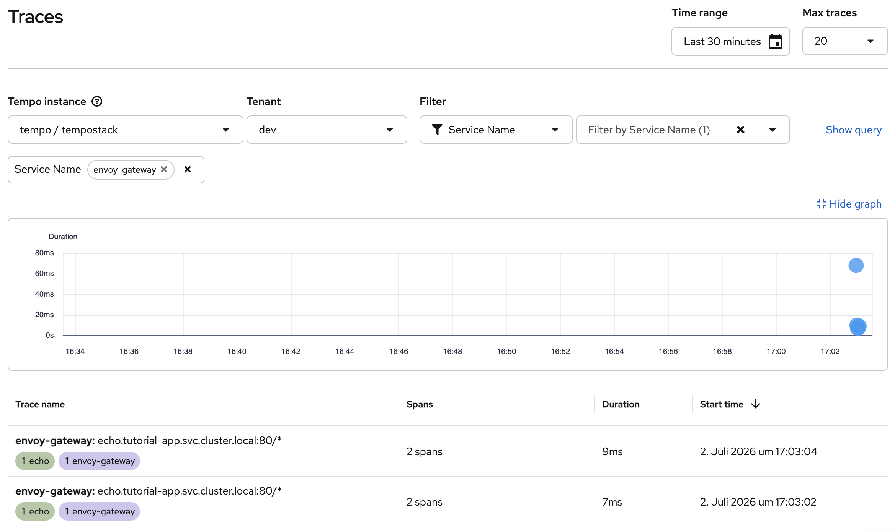

# 09c — Tracing (Optional)

**What you'll learn:** Deploy distributed tracing for Connectivity Link using the Tempo Operator, an OpenTelemetry Collector, and the OpenShift Distributed Tracing console plugin for trace visualization.

**Prerequisites:**
- Section 09b completed (COO installed, Perses dashboards working)
- S3-compatible object storage — this tutorial assumes **OpenShift Data Foundation (ODF)** is installed; see [tempostack/README.md](tempostack/README.md) for alternatives if ODF is unavailable

## Overview

Distributed tracing lets you follow a single request as it flows through the gateway, policy enforcement components, and into your application. By instrumenting the echo service with an OpenTelemetry sidecar collector and auto-instrumentation, we get correlated end-to-end traces from Envoy through the application — not just isolated spans from each component.

```
                          ┌──────────────────────────────────────┐
                          │ Tempo namespace                      │
  ┌─────────┐             │                                      │
  │ Envoy   │─OTLP/gRPC──►│  OTel Collector ──► Tempo Gateway    │
  │ gateway │             │         ▲                 │          │
  └────┬────┘             │         │                 ▼          │
       │ traceparent      │         │          ┌───────────────┐ │
  ┌────▼──────────────┐   │         │          │ Distributor   │ │
  │ Echo Pod          │──►│         │          └───────┬───────┘ │
  │  echo app + OTel  │   │                            ▼         │
  │  sidecar          │   │                        ┌─────────┐   │
  └───────────────────┘   │                        │ Ingester│   │
  ┌─────────┐             │                        └────┬────┘   │
  │Authorino│─OTLP/gRPC──►│                             ▼        │
  └─────────┘             │                        ┌─────────┐   │
  ┌─────────┐             │                        │ ODF/S3  │   │
  │Limitador│─OTLP/gRPC──►│                        └─────────┘   │
  └─────────┘             └──────────────────────────────────────┘
                                       │
                                       ▼
                         ┌──────────────────────────────────────┐
                         │ OpenShift Console                    │
                         │ Observe → Traces (Distributed        │
                         │ Tracing UI Plugin)                   │
                         └──────────────────────────────────────┘
```

**Architecture highlights:**

- The TempoStack is deployed with **multi-tenancy** and a **gateway** for access control.
- A **central OpenTelemetry Collector** acts as an intermediary — it authenticates with the Tempo gateway using a bearer token and forwards traces to the correct tenant.
- **Envoy proxy tracing** is configured via an `EnvoyFilter` that patches the Envoy HTTP Connection Manager directly. This is necessary because the `openshift-gateway` Istio CR is managed by the Cluster Ingress Operator and does not allow adding custom `extensionProviders`.
- **Kuadrant component tracing** (Authorino, Limitador, wasm-shim) is configured via the `Kuadrant` CR `spec.observability.tracing`.
- **Echo service tracing** uses an OTel Collector **sidecar** injected into the echo pod, combined with Python **auto-instrumentation** via the `Instrumentation` CR. The sidecar forwards traces to the central collector. Because Envoy propagates the `traceparent` header to the echo service, the echo spans are correlated with the Envoy spans in a single trace.
- Traces are visualized through the **Distributed Tracing console plugin** (Observe → Traces in the OpenShift web console).


## Step 0: Deploy TempoStack

TempoStack stores trace data and serves it to the Distributed Tracing console plugin. It requires S3-compatible object storage — the install script provisions a NooBaa bucket via ODF and deploys a multi-tenant TempoStack with a gateway.

```bash
./09-observability/09c-tracing/tempostack/install-tempostack.sh
```

> **No ODF?** If object storage is not available, you can skip tracing entirely or deploy an alternative S3 backend (MinIO, SeaweedFS, etc.) — see [tempostack/README.md](tempostack/README.md) for manual steps and the `tempo-bucket-secret` format.

The script applies the Tempo Operator subscription, creates an `ObjectBucketClaim`, builds the storage secret from OBC credentials, and deploys TempoStack. When it finishes, all TempoStack pods (including the gateway) should be Running:

```bash
oc get pods -n tempo -l app.kubernetes.io/instance=tempostack
```

If you prefer to run each step manually, follow the [TempoStack installation guide](tempostack/README.md).


## Step 1: Install the Red Hat build of OpenTelemetry Operator

The OpenTelemetry Operator provides the `OpenTelemetryCollector` CRD. The collector is needed as an intermediary between Envoy/Kuadrant components and the multi-tenant Tempo gateway (it handles bearer token authentication and tenant routing).

```bash
oc apply -f 09-observability/09c-tracing/otel-subscription.yaml
```

Wait for the operator to install:

```bash
oc wait --for=jsonpath='{.status.state}'=AtLatestKnown \
  subscription/opentelemetry-product -n openshift-opentelemetry-operator --timeout=180s
```

The subscription reaching `AtLatestKnown` only means the install plan was created — the operator pod (and its admission webhook) may not be ready yet. Wait for the CSV to succeed before creating any `OpenTelemetryCollector` resources, otherwise `oc apply` fails with a webhook connection error:

```bash
CSV=$(oc get subscription opentelemetry-product -n openshift-opentelemetry-operator -o jsonpath='{.status.installedCSV}')
oc wait csv/"$CSV" -n openshift-opentelemetry-operator --for=jsonpath='{.status.phase}'=Succeeded --timeout=180s
```

## Step 2: Deploy the OpenTelemetry Collector

Deploy an OpenTelemetry Collector that receives OTLP traces and forwards them to the Tempo gateway with bearer token authentication and the correct tenant header.

```bash
oc apply -f 09-observability/09c-tracing/otel-collector.yaml
```

Key configuration:

- **Receives** OTLP gRPC on port 4317 — Envoy and Kuadrant components send traces here
- **Exports** via OTLP HTTP to the Tempo gateway on port 8080, with the tenant name (`dev`) in the URL path
- **Bearer token auth** — uses the ServiceAccount token to authenticate with the Tempo gateway
- **TLS** — trusts the OpenShift service CA to validate the gateway's certificate

Verify the collector is running:

```bash
oc wait --for=condition=Ready pod -l app.kubernetes.io/name=otel-collector -n tempo --timeout=120s

oc logs -n tempo -l app.kubernetes.io/name=otel-collector --tail=5
# Should see: "Everything is ready. Begin running and processing data."
```


## Step 3: Configure Envoy Proxy Tracing

The `openshift-gateway` Istio CR is managed by the Cluster Ingress Operator, which prevents adding custom `extensionProviders` to the mesh config. To enable Envoy proxy tracing, we use an `EnvoyFilter` that directly patches the Envoy HTTP Connection Manager with an OpenTelemetry tracing configuration.

```bash
oc apply -f 09-observability/09c-tracing/envoy-tracing-filter.yaml
```

This EnvoyFilter:

- Targets the `api-gateway` workload via `workloadSelector`
- Configures the HTTP Connection Manager's tracing provider to use OpenTelemetry
- Points to the OTel Collector cluster at `otel-collector.tempo.svc.cluster.local:4317`
- Sets 100% sampling (adjust for production)

Verify the Envoy proxy picked up the tracing configuration:

```bash
GWPOD=$(oc get pods -n openshift-ingress -l gateway.networking.k8s.io/gateway-name=api-gateway -o jsonpath='{.items[0].metadata.name}')
oc exec -n openshift-ingress $GWPOD -- pilot-agent request GET config_dump 2>/dev/null \
  | jq -r '
      .configs[]
      | select(."@type" | contains("ListenersConfigDump"))
      | .dynamic_listeners[]
      | .active_state.listener.filter_chains[].filters[].typed_config
      | select(has("tracing"))
      | "Tracing configured: \(.tracing.provider.name)"
    '
# Should output: Tracing configured: envoy.tracers.opentelemetry
```


## Step 4: Configure Data-Plane Tracing in the Kuadrant CR

Update the Kuadrant CR to enable tracing for the wasm-shim, Authorino, and Limitador. This sends traces from the Connectivity Link policy engine to the OTel Collector.

```bash
oc apply -f 09-observability/09c-tracing/kuadrant-tracing.yaml
```

Key configuration:

- `tracing.defaultEndpoint` — points to the OTel Collector using gRPC OTLP (`rpc://` prefix, port 4317)
- `dataPlane.httpHeaderIdentifier` — correlates traces across components using the `x-request-id` header that Envoy generates for each request

Wait for the Kuadrant CR to reconcile:

```bash
oc wait kuadrant/kuadrant --for="condition=Ready=true" -n kuadrant-system --timeout=120s
```


## Step 5: Instrument the Echo Service

The echo service is a Python ASGI application. We combine three mechanisms to get correlated end-to-end traces:

1. **Sidecar collector** — an OTel Collector injected into the echo pod that receives traces on `localhost` and forwards them to the central collector.
2. **Auto-instrumentation** — the OTel Operator injects the OpenTelemetry Python SDK into the echo container via an init container.
3. **ASGI middleware** — a small code addition in `main.py` wraps the raw ASGI app with `OpenTelemetryMiddleware`, which creates spans for each HTTP request and reads the `traceparent` header propagated by Envoy.


### 5a: Prepare the echo service code

The auto-instrumentation injects the OTel Python SDK at runtime, but it cannot automatically wrap a raw ASGI function. The echo service's `main.py` includes a `try/except` block that applies the middleware when the SDK is available:

```python
try:
    from opentelemetry.instrumentation.asgi import OpenTelemetryMiddleware
    app = OpenTelemetryMiddleware(app, exclude_spans=["send", "receive"])
except ImportError:
    pass
```

The `exclude_spans=["send", "receive"]` option suppresses the low-level ASGI `http send`/`http receive` sub-spans that the middleware creates by default — without it, each request would generate 3 echo spans instead of 1 clean `GET /` span. When running without auto-instrumentation, the import fails gracefully and the app runs unmodified.

### 5b: Deploy the sidecar collector and instrumentation CRs

```bash
oc apply -f 09-observability/09c-tracing/otel-sidecar.yaml
oc apply -f 09-observability/09c-tracing/otel-instrumentation.yaml
```

Key details:

- The sidecar listens on both **gRPC (4317)** and **HTTP (4318)**. The Python auto-instrumentation uses the `http/protobuf` protocol by default, so it sends to the HTTP receiver on port 4318.
- The `Instrumentation` CR sets `exporter.endpoint: http://localhost:4318` and `propagators: [tracecontext, baggage]` — the `tracecontext` propagator reads `traceparent` headers from incoming requests, linking echo spans to Envoy parent spans.
- The `Instrumentation` CR disables **metrics and logs** export (`OTEL_METRICS_EXPORTER=none`, `OTEL_LOGS_EXPORTER=none`) because the sidecar collector only has a traces pipeline.


### 5c: Apply the echo deployment

The echo deployment in `04-app/deployment.yaml` includes the required annotations on the pod template:

- `sidecar.opentelemetry.io/inject: "true"` — triggers sidecar collector injection
- `instrumentation.opentelemetry.io/inject-python: "true"` — triggers Python auto-instrumentation

Apply (or re-apply) the deployment, then restart the pod so the OTel operator injects the sidecar:

```shell
oc apply -f 04-app/deployment.yaml
oc rollout restart deployment/echo -n tutorial-app
oc rollout status deployment/echo -n tutorial-app --timeout=180s
```


### 5d: Verify the echo pod

The echo pod should now have the sidecar collector as a native sidecar (init container with `restartPolicy: Always`) and the auto-instrumentation init container:

```bash
oc get pod -n tutorial-app -l app=echo
# Should show 2/2 Running

oc get pod -n tutorial-app -l app=echo \
  -o jsonpath='{range .items[0].spec.initContainers[*]}{.name}{"\n"}{end}'
# Should show:
#   otc-container
#   opentelemetry-auto-instrumentation-python
```

> **Why a sidecar?** The sidecar collector runs on `localhost` inside the pod, so the auto-instrumented app can export traces without network overhead. The sidecar then forwards to the central collector which handles authentication and tenant routing to the TempoStack gateway.


## Step 6: Enable the Distributed Tracing Console Plugin

The Distributed Tracing UI Plugin adds an **Observe → Traces** menu item to the OpenShift web console, providing full trace search and waterfall visualization powered by the TempoStack. Since we deployed a multi-tenant TempoStack with a gateway, the plugin auto-discovers it.

```bash
oc apply -f 09-observability/09c-tracing/tracing-ui-plugin.yaml
```

Wait for the plugin to become available:

```bash
oc wait uiplugin/distributed-tracing --for=condition=Available --timeout=120s

oc get consoleplugin distributed-tracing-console-plugin
```

> **Note:** You may need to refresh the OpenShift web console (or log out and back in) for the new **Observe → Traces** menu item to appear.


## Step 7: Verify Tracing End-to-End

### 7a: Generate Traffic

Obtain a token from Keycloak (AuthPolicy requires JWT authentication) and send requests through the gateway:

```shell
source export-cluster-env.sh
export TOKEN=$(get_token)

for i in $(seq 1 5); do
  curl -sk -o /dev/null -w "Request $i: HTTP %{http_code}\n" \
    "https://echo.$CLUSTER_DOMAIN/" \
    -H "Authorization: Bearer $TOKEN"
  sleep 1
done
```

> **Note:** Tokens expire after 5 minutes. Re-run `export TOKEN=$(get_token)` if you get HTTP 401 responses.


### 7b: Check Envoy Trace Delivery

Verify Envoy is sending traces to the OTel Collector by checking the Envoy cluster stats:

```bash
GWPOD=$(oc get pods -n openshift-ingress -l gateway.networking.k8s.io/gateway-name=api-gateway -o jsonpath='{.items[0].metadata.name}')
oc exec -n openshift-ingress $GWPOD -- pilot-agent request GET clusters 2>/dev/null \
  | grep "otel-collector.tempo.svc.cluster.local.*rq_total"
# rq_total should be > 0
```


### 7c: View Traces in the OpenShift Console

1. Open the OpenShift web console
2. Navigate to **Observe → Traces**
3. Select the **dev** tenant and search for traces by service name or time range
4. You should see traces from these service names:
  - **envoy-gateway** — Envoy proxy processing
  - **echo** — the echo application (auto-instrumented Python)
  - **authorino** — JWT authentication and authorization
  - **limitador** — rate limit checks
  - **wasm-shim** — the Connectivity Link wasm-shim policy engine



> **What to expect:** The `envoy-gateway` and `echo` traces are **correlated** — because Envoy propagates the `traceparent` header to the echo service, the echo span appears as a child of the Envoy span in a single trace. A typical correlated trace has **2 spans**: 1 envoy-gateway root span → 1 echo `GET /` child span. In the Distributed Tracing UI, look for traces with `rootServiceName=envoy-gateway` — when you expand them, you'll see the echo child span in the waterfall view. (The `exclude_spans=["send", "receive"]` option in `OpenTelemetryMiddleware` suppresses the noisy ASGI `http send`/`http receive` sub-spans.)
>
> Traces from `authorino` and `limitador` contain **a single span** each, as these components report independently. The **wasm-shim** traces are the most informative with **10+ spans** showing the full Kuadrant policy evaluation pipeline.


### 7d: Correlate with Request IDs

The `httpHeaderIdentifier: x-request-id` in the Kuadrant CR ensures the `x-request-id` header appears in trace spans:

```bash
curl -sk -v "https://echo.$CLUSTER_DOMAIN/" \
  -H "Authorization: Bearer $TOKEN" 2>&1 | grep x-request-id
# < x-request-id: a1b2c3d4-e5f6-7890-abcd-ef1234567890
```

Use that request ID to search for the correlated trace in **Observe → Traces**.

## Understanding the Trace Data

With the echo service instrumented via auto-instrumentation and sidecar, and Kuadrant tracing enabled, you get **correlated traces** between Envoy and the echo application, plus policy-engine visibility.


| Service name             | Typical spans per trace | What it shows                                                                                                                                          |
| ------------------------ | ----------------------- | ------------------------------------------------------------------------------------------------------------------------------------------------------ |
| `envoy-gateway` + `echo` | 2 (correlated)          | End-to-end: 1 Envoy root span → 1 echo `GET /` child span. Envoy propagates `traceparent` to the echo service, so both spans appear in a single trace. |
| `authorino`              | 1                       | A single authentication/authorization check                                                                                                           |
| `limitador`              | 1                       | A single rate-limit evaluation                                                                                                                         |
| `wasm-shim`              | 10+                     | The full Kuadrant policy evaluation pipeline                                                                                                           |


**Correlated Envoy + echo traces** show the full request lifecycle: how long the request spent in the Envoy proxy vs. how long the application took to process it. This is the key benefit of instrumenting the echo service.

**The wasm-shim trace** is where you get the richest policy debugging insight. The wasm-shim runs as a Wasm filter inside Envoy and orchestrates the entire policy evaluation. Its trace spans show:

- **Duration** of each policy evaluation step
- **Calls to Authorino** for authentication/authorization
- **Calls to Limitador** for rate-limit checks
- **Success or failure** of each policy check
- **Request metadata** (path, method, response code)

**Correlating across components:** While `authorino` and `limitador` traces are separate, you can correlate them using the `x-request-id` header. When you send a request, Envoy assigns an `x-request-id` that is passed to all Kuadrant components. Search for this value in the trace attributes to find all related spans across services.

## Troubleshooting


| Symptom                                                         | Likely cause                                                       | What to check                                                                                                                           |
| --------------------------------------------------------------- | ------------------------------------------------------------------ | --------------------------------------------------------------------------------------------------------------------------------------- |
| No **Observe -> Traces** menu item                              | UI plugin not available yet / stale browser session                | `oc get uiplugin distributed-tracing`; refresh console or log out/in                                                                    |
| `curl` to echo returns `401`                                    | Missing or expired token                                           | Re-run `export TOKEN=$(get_token)`; token lifetime is short                                                                             |
| Traces exist but no `echo` spans                                | Echo instrumentation not active                                    | Echo pod annotations in `04-app/deployment.yaml`; `otc-container` and `opentelemetry-auto-instrumentation-python` init/sidecar presence |
| `envoy-gateway` trace exists but not correlated with `echo`     | Missing/incorrect trace context propagation or outdated echo image | Confirm echo uses middleware with `OpenTelemetryMiddleware`; re-rollout deployment if needed                                            |
| No new traces from gateway                                      | Envoy not exporting to collector                                   | `pilot-agent request GET clusters` check in 7b (`rq_total > 0`)                                                                        |
| No `wasm-shim`/`authorino`/`limitador` traces                   | Kuadrant tracing not configured                                    | Check `09-observability/09c-tracing/kuadrant-tracing.yaml` applied and Kuadrant `Ready` condition                                       |


## Verify

- [ ] `oc get csv -n tempo` shows Tempo Operator with `Succeeded`
- [ ] `oc get tempostack/tempostack -n tempo` shows `Ready`
- [ ] `oc get pods -n tempo -l app.kubernetes.io/instance=tempostack` shows all components Running (including `gateway`)
- [ ] `oc get csv -n openshift-opentelemetry-operator` shows OpenTelemetry Operator with `Succeeded`
- [ ] `oc get pods -n tempo -l app.kubernetes.io/name=otel-collector` shows Running
- [ ] `oc get envoyfilter otel-tracing -n openshift-ingress` exists
- [ ] `oc get kuadrant -n kuadrant-system` shows `Ready` with tracing configured
- [ ] `oc get otelinst echo-instrumentation -n tutorial-app` exists
- [ ] Echo pod has a sidecar container: `oc get pod -n tutorial-app -l app=echo -o jsonpath='{.items[0].spec.containers[*].name}'` includes `otc-container`
- [ ] `oc get uiplugin distributed-tracing` shows `Available`
- [ ] Envoy cluster stats show `rq_total > 0` for the OTel Collector cluster
- [ ] Traces from `envoy-gateway`, `echo`, `authorino`, `limitador`, and `wasm-shim` are visible in **Observe → Traces**
- [ ] `envoy-gateway` and `echo` traces are correlated (appear in the same trace with parent-child relationship)

---

## Appendix: Why these components exist

- **Central OTel Collector:** Needed because TempoStack is multi-tenant behind a gateway; the collector handles auth and tenant routing.
- **EnvoyFilter tracing patch:** Required because the managed gateway setup does not allow custom mesh `extensionProviders`.
- **Echo sidecar collector + Python auto-instrumentation:** Gives app spans without building collector/auth logic into the app itself.
- **Distributed Tracing UI plugin:** Native OpenShift trace search and waterfall view without relying on Jaeger UI.
- **Kuadrant tracing:** Adds policy-engine visibility for debugging real API protection flows, beyond simple gateway-to-app latency.

---

Next: [09d — Access Logs](../09d-access-logs/README.md)
