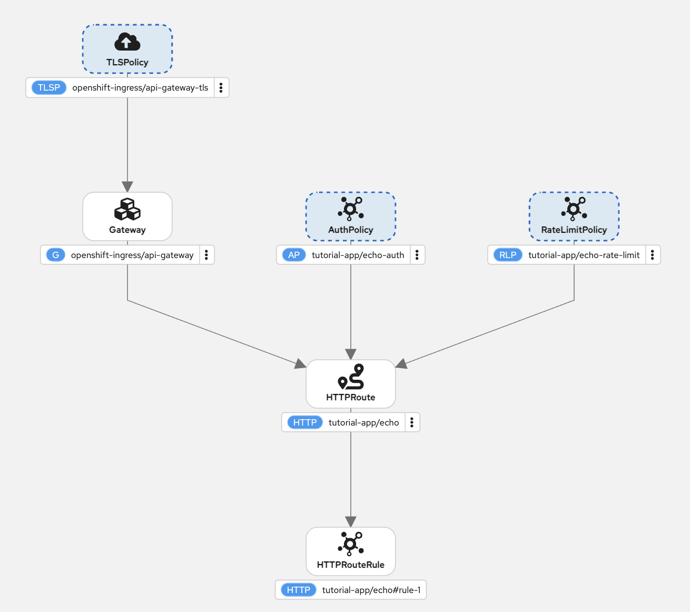

# Red Hat Connectivity Link 1.3 Tutorial

Hands-on tutorial for securing, protecting, and observing APIs on OpenShift using Red Hat Connectivity Link 1.3 and the Kubernetes Gateway API.

## What You'll Learn

- Install Red Hat Connectivity Link on OpenShift
- Create a Gateway and expose a REST service via HTTPRoute
- Secure traffic with **TLSPolicy** (automated certificate management)
- Protect APIs and configure IP restrictions with **AuthPolicy** (OIDC authentication via Keycloak)
- Rate-limit traffic with **RateLimitPolicy**
- Set up **Observability** with Perses dashboards, metrics, and tracing
- Connect **external services** (public APIs and remote clusters) through the Gateway



## Prerequisites

- OpenShift Container Platform 4.19+ with `cluster-admin` access
- `oc` CLI installed and logged in
- `envsubst` (GNU gettext) and `python3`
- Red Hat subscription including Connectivity Link
- cert-manager Operator for Red Hat OpenShift 1.18+ installed

Set common environment variables once:

```shell
source export-cluster-env.sh
```

## Tutorial Sections

| # | Section | Description |
|---|---------|-------------|
| 00 | [Prerequisites](./00-prerequisites/) | Cluster and tooling requirements |
| 01 | [Install Connectivity Link](./01-install/) | Operator and Kuadrant CR setup (RHCL 1.3) |
| 02 | [cert-manager Setup](./02-cert-manager/) | Certificate issuer configuration |
| 03 | [Create Gateway](./03-gateway/) | Gateway API resource (HTTP) |
| 04 | [Deploy Application](./04-app/) | Sample REST service + HTTPRoute |
| 05 | [TLS Policy](./05-tls-policy/) | Automate TLS certificates (HTTPS) |
| 06 | [Auth Policy](./06-auth-policy/) | OIDC authentication via Keycloak |
| 07 | [IP Restriction](./07-ip-restriction/) | Source IP denylisting via AuthPolicy |
| 08 | [Rate Limit Policy](./08-rate-limit-policy/) | Request rate limiting |
| 09 | [Observability](./09-observability/) | Metrics, Perses dashboards, tracing |
| 10 | [External Services](./10-external-services/) | Route to external REST and SOAP services through the Gateway |
| 11 | [Cleanup](./11-cleanup/) | Remove tutorial resources |

## References

- [Red Hat Connectivity Link 1.3 Documentation](https://docs.redhat.com/en/documentation/red_hat_connectivity_link/1.3/)
- [Kubernetes Gateway API](https://gateway-api.sigs.k8s.io/)
- [Kuadrant Open Source Project](https://kuadrant.io/)
